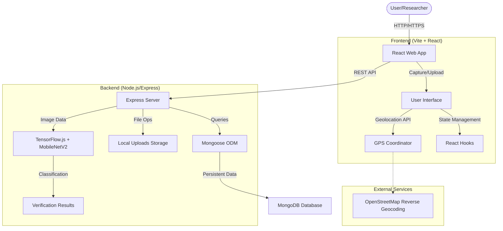

# System Architecture - HoneyBee

HoneyBee is designed as a full-stack application for automated Rock Bee (Apis dorsata) colony detection and conservation monitoring.

## 🏗️ Architecture Overview

The system follows a standard Client-Server architecture with integrated AI/ML processing.

## 🛠️ Tech Stack

### Frontend
- **Framework**: React 18
- **Build Tool**: Vite
- **Styling**: Vanilla CSS (Custom Glassmorphism Design)
- **Icons**: Lucide React
- **APIs**: Browser Geolocation, OpenStreetMap Nominatim

### Backend
- **Runtime**: Node.js
- **Framework**: Express.js
- **AI/ML**: TensorFlow.js Core, MobileNetV2 Model
- **Image Processing**: Sharp
- **Database**: MongoDB with Mongoose ODM
- **Middleware**: Multer (File uploads), CORS, Dotenv

## 🔄 Core Workflow (Verification Flow)

1. **Input**: User uploads an image or captures it via camera.
2. **Context**: GPS coordinates are fetched and reverse-geocoded to an address.
3. **Transmission**: Image and metadata are sent to the `/api/verify-image` endpoint.
4. **Processing**:
    - Backend uses `sharp` to convert the image buffer into a raw tensor.
    - `MobileNetV2` analyzes the tensor for bee/hive features.
    - Confidence score is calculated based on semantic markers.
5. **Output**: System provides safety guidelines and emergency contacts based on the detection result and location.
6. **Persistence**: Verified reports are saved to MongoDB for research analytics.
